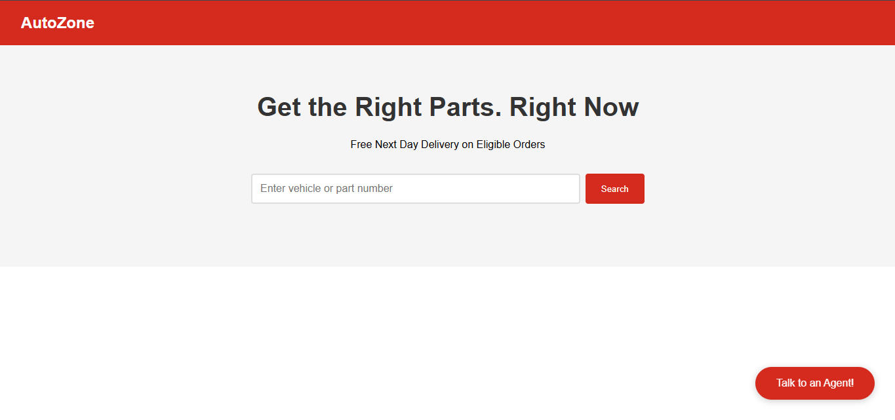

# AI Voice Assistant

A state-of-the-art voice assistant built with Python, OpenAI, and LiveKit, designed to interact with users, call Python functions, and integrate seamlessly with your custom frontend. 

Key Features:
- Natural language processing with OpenAI's GPT
- Real-time voice interaction
- Integration with a custom frontend using React
- Built with LiveKit for easy AI agent management


## Table of Contents
- [Overview](#overview)
- [Features](#features)
- [Installation](#installation)
- [Usage](#usage)
- [License](#license)

## Installation

To get started with the AI Voice Assistant, follow these steps:

1. Clone the repository:
   ```bash
   git clone https://github.com/yourusername/yourproject.git
   ```
2. Navigate to the project directory:
   ```bash
   cd yourproject
   ```
3. Install dependencies:
   ```bash
   pip install -r requirements.txt
   ```

4. Set up your environment variables:
   - Create a `.env` file in the root directory and add your OpenAI API key.

5. Run the Python backend:
   ```bash
   python app.py
   ```

6. Start the React frontend (if applicable):
   ```bash
   npm start
   ```

## Usage

After running the backend and frontend, you can interact with the AI assistant through voice commands or text inputs. Example interactions:
- **"What's the weather today?"**
- **"Run a Python function to check system status."**
- **"Integrate with my calendar."**


## Demo

# AI Voice Assistant Project

This is a project where we build an AI voice agent with Python and React.

## Project Screenshot




## Technologies Used
- Python
- LiveKit
- OpenAI GPT
- React.js
- Node.js
- Docker (optional for deployment)

## Contributing

Feel free to submit issues, fork the project, and create pull requests. If you're adding a feature or fixing a bug, please ensure that your code follows the existing style and is well-documented.

To get started with development:
1. Fork the repository
2. Clone your forked repo
3. Create a new branch: `git checkout -b feature-name`
4. Make changes and commit them
5. Push to your fork: `git push origin feature-name`
6. Create a pull request

## License

This project is licensed under the MIT License - see the [LICENSE](LICENSE) file for details.

